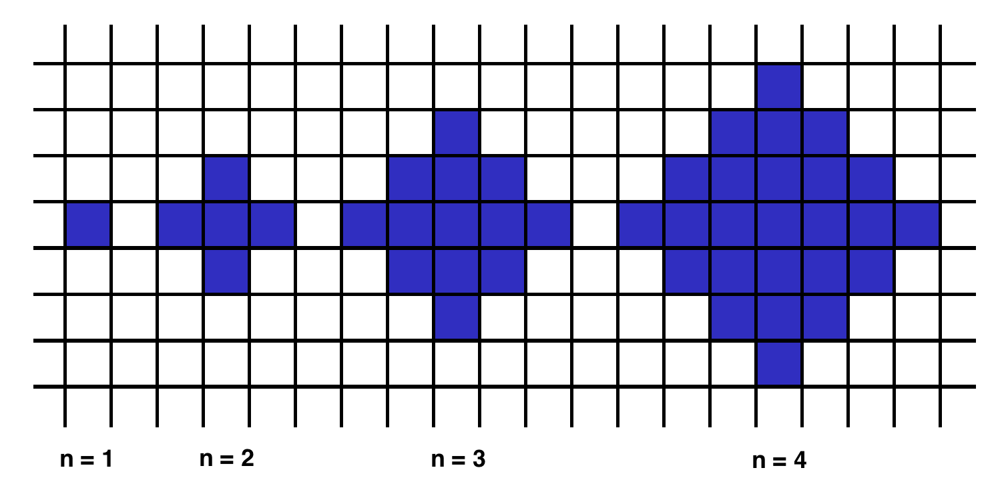

## century
    Given a year, return the century it is in. The first century spans from the year 1 up to and 
    including the year 100, the second - from the year 101 up to and including the year 200, etc.
  Example
    
    For year = 1905, the output should be
    solution(year) = 20;
    For year = 1700, the output should be
    solution(year) = 17.

```java

int solution(int year) {
    
    if(year <= 100){
        return 1;
    }
    int result = year / 100;
    if (year % 100 > 0){
        result += 1;
    }
    return result;

}

```

## check palindrome

    Given the string, check if it is a palindrome.

    A string that doesn't change when reversed (it reads the same backward and forward).

  Examples:
      
      "eye" is a palindrome
      "noon" is a palindrome
      "decaf faced" is a palindrome
      "taco cat" is not a palindrome (backwards it spells "tac ocat")
      "racecars" is not a palindrome (backwards it spells "sracecar")
    
  Example
      
      For inputString = "aabaa", the output should be
      solution(inputString) = true;
      For inputString = "abac", the output should be
      solution(inputString) = false;
      For inputString = "a", the output should be
      solution(inputString) = true.
    
```java
static String reverseString(String theString){
    StringBuilder sb = new StringBuilder();
    for(int i=theString.length()-1; i >=0; i--){
        sb.append(theString.charAt(i));
    }
    return sb.toString();
}

boolean solution(String inputString) {
    return inputString.equals(reverseString(inputString));

}


```
---

## adjacentElementsProduct

    Given an array of integers, find the pair of adjacent elements that 
    has the largest product and return that product.

Example

    For inputArray = [3, 6, -2, -5, 7, 3], the output should be
    solution(inputArray) = 21.

    7 and 3 produce the largest product.

Input/Output

    [execution time limit] 3 seconds (java)

    [memory limit] 1 GB

    [input] array.integer inputArray

An array of integers containing at least two elements.

    Guaranteed constraints:
    2 ≤ inputArray.length ≤ 10,
    -1000 ≤ inputArray[i] ≤ 1000.

    [output] integer

    The largest product of adjacent elements.

```java


int solution(int[] inputArray) {
    int result = -2147483648;
    for(int i=1; i<inputArray.length; i++){
        int product = inputArray[i] * inputArray[i-1];
        result = Math.max(result, product);
    }
    return result;

}


```

---
## shapeArea

        Below we will define an n-interesting polygon. Your task is to find the area of a polygon for a given n.

        A 1-interesting polygon is just a square with a side of length 1. 
        
        An n-interesting polygon is obtained by taking the n - 1-interesting polygon 
        
        and appending 1-interesting polygons to its rim, side by side. 
        
        You can see the 1-, 2-, 3- and 4-interesting polygons in the picture below.



Example

        For n = 2, the output should be
        solution(n) = 5;
        For n = 3, the output should be
        solution(n) = 13.

Input/Output

        [execution time limit] 3 seconds (java)

        [memory limit] 1 GB

        [input] integer n

        Guaranteed constraints:
        1 ≤ n < 104.

        [output] integer

        The area of the n-interesting polygon.

```java

static int nthOdd(int n){
    int oddCounter = 0;
    int number = 1;
    while (oddCounter < n){
        if(number % 2 != 0){
            oddCounter += 1;
        }
        number += 1;

    }
    return number - 1;
}

int solution(int n) {
    
    int oddNumber = nthOdd(n);
    int stripOff = (n*(n-1))/ 2;
    int result = (oddNumber * oddNumber) - (4 * stripOff);
    return result;
    

}


```

---

## Make Array Consecutive 2

    Ratiorg got statues of different sizes as a present from CodeMaster 
    
    for his birthday, each statue having an non-negative integer size. 
    
    Since he likes to make things perfect, he wants to arrange them from 
    
    smallest to largest so that each statue will be bigger than the previous 
    
    one exactly by 1. He may need some additional statues to be able to accomplish 
    
    that. Help him figure out the minimum number of additional statues needed.

Example

    For statues = [6, 2, 3, 8], the output should be
    solution(statues) = 3.

    Ratiorg needs statues of sizes 4, 5 and 7.

Input/Output

    [execution time limit] 3 seconds (java)

    [memory limit] 1 GB

    [input] array.integer statues

    An array of distinct non-negative integers.

    Guaranteed constraints:
    1 ≤ statues.length ≤ 10,
    0 ≤ statues[i] ≤ 20.

    [output] integer

    The minimal number of statues that need to be added to existing 
    
    statues such that it contains every integer size from an interval [L, R] (for some L, R) and no other sizes.

```java

int solution(int[] statues) {
    Arrays.sort(statues);
    int result= 0;
    for(int i=1; i<statues.length; i++){
        int difference = statues[i] - statues[i-1];
        if(difference <= 1){
            continue;
        }else if(difference > 1){
            difference = difference - 1;
        }

        result += difference;
    }
    return result;
}

int solution(int[] statues) {
    Arrays.sort(statues);
    int statuesLength = statues.length;
    int minStatus = statues[0];
    int maxStatus = statues[statuesLength - 1];
    int totalNumberOfElementsFromStartToEnd = (maxStatus - minStatus) + 1;
    int numberOfElementsLeft = totalNumberOfElementsFromStartToEnd - statuesLength;
    return numberOfElementsLeft;
}


```

## almostIncreasingSequence

    Given a sequence of integers as an array, determine whether 
    
    it is possible to obtain a strictly increasing 
    
    sequence by removing no more than one element from the array.

    Note: sequence a0, a1, ..., an is considered to be a 
    
    strictly increasing if a0 < a1 < ... < an. Sequence 
    
    containing only one element is also considered to be strictly increasing.

Example

    For sequence = [1, 3, 2, 1], the output should be
    solution(sequence) = false.

    There is no one element in this array that can be removed in order to get a strictly increasing sequence.

    For sequence = [1, 3, 2], the output should be
    solution(sequence) = true.

    You can remove 3 from the array to get the strictly increasing 
    
    sequence [1, 2]. Alternately, you can remove 2 to get the strictly increasing sequence [1, 3].


Input/Output

    [execution time limit] 3 seconds (java)

    [memory limit] 1 GB

    [input] array.integer sequence

    Guaranteed constraints:
    2 ≤ sequence.length ≤ 105,
    -105 ≤ sequence[i] ≤ 105.

    [output] boolean

    Return true if it is possible to remove one element from the array
    
    in order to get a strictly increasing sequence, otherwise return false.

```java


boolean solution(int[] sequence) {
    
    int size = sequence.length;
    int numberOfTimesItDecreases = 0;
    
    for(int i=0; i <size -1; i++){
        if(sequence[i+1] <= sequence[i]){
            numberOfTimesItDecreases++;
            boolean skipNeighbor = i+2 < size && sequence[i+2] <= sequence[i];
            boolean skipBack = i-1 >=0 && sequence[i+1] <= sequence[i-1];
            if(skipNeighbor && skipBack  || numberOfTimesItDecreases >=2){return false;}
        }
    }
    
    return true;
}


```
## matrixElementsSum

    After becoming famous, the CodeBots decided to move into a new 
    
    building together. Each of the rooms has a different cost, and 
    
    some of them are free, but there's a rumour that all the free 
    
    rooms are haunted! Since the CodeBots are quite superstitious, 
    
    they refuse to stay in any of the free rooms, or any of the rooms below any of the free rooms.

    Given matrix, a rectangular matrix of integers, 
    
    where each value represents the cost of the room, 
    
    your task is to return the total sum of all rooms that 
    
    are suitable for the CodeBots (ie: add up all the values that don't appear below a 0).

Example

    For

    matrix = [[0, 1, 1, 2], 
            [0, 5, 0, 0], 
            [2, 0, 3, 3]]

    the output should be
    solution(matrix) = 9.


    There are several haunted rooms, so we'll disregard them 
    
    as well as any rooms beneath them. Thus, the answer is 1 + 5 + 1 + 2 = 9.

    For

    matrix = [[1, 1, 1, 0], 
            [0, 5, 0, 1], 
            [2, 1, 3, 10]]

    the output should be
    solution(matrix) = 9.


```java


int solution(int[][] matrix) {
    int row = matrix.length;
    int col = matrix[0].length;
    int ans = 0;
    
    for(int i=0; i<col; i++){
        for(int j=0; j<row; j++){
            int val = matrix[j][i];
            if(val == 0){
                break;
            }else{
                ans += val;
            }
        }
    }
    
    return ans;
}


```

---

## All Longest Strings

        Given an array of strings, return another array containing all of its longest strings.
        
        Example
        
        For inputArray = ["aba", "aa", "ad", "vcd", "aba"], the output should be
        
        solution(inputArray) = ["aba", "vcd", "aba"].
        
        Input/Output
        
        [execution time limit] 3 seconds (java)
        
        [memory limit] 1 GB
        
        [input] array.string inputArray
        
        A non-empty array.
        
        Guaranteed constraints:
        
        1 ≤ inputArray.length ≤ 10,
        
        1 ≤ inputArray[i].length ≤ 10.
        
        [output] array.string
        
        Array of the longest strings, stored in the same order as in the inputArray.


```java

String[] solution(String[] inputArray) {
    
    int maxLength = -1;
    Map<Integer, List<String>> store = new HashMap<>();

    for(String s : inputArray){
        int stringLength = s.length();
        maxLength = Math.max(maxLength, stringLength);
        // put into the hash map
        store.computeIfAbsent(stringLength, k -> new ArrayList<>()).add(s);
    }
    
    return store.get(maxLength).stream().toArray(String[]::new);

}

```


